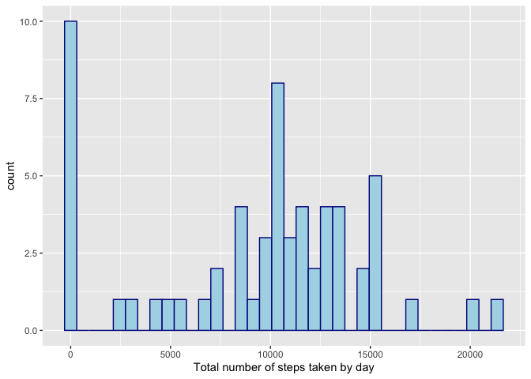
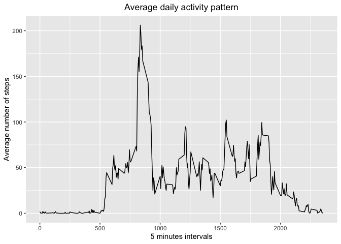
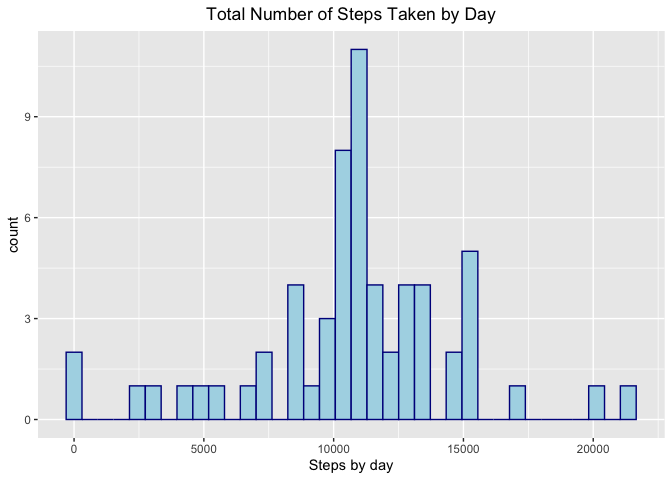

### Loading required libraries


```r
library(dplyr)
```

```
## 
## Attaching package: 'dplyr'
```

```
## The following objects are masked from 'package:stats':
## 
##     filter, lag
```

```
## The following objects are masked from 'package:base':
## 
##     intersect, setdiff, setequal, union
```

```r
library(ggplot2)
```

### Loading and preprocessing the data


```r
df <- read.table("data/activity.csv", sep = ",", header = T)
df$date <- as.Date(as.character(df$date))
```

### Calculate the number of steps by day


```r
stepsByDay <- df %>%
   group_by(date) %>%
   summarise(steps = sum(steps, na.rm = T))
```

### Histogram of the total number of steps taken by day


```r
ggplot(stepsByDay, aes(steps)) + 
   geom_histogram(binwidth = 610, color = "darkblue", fill = "lightblue") +
   xlab("Steps taken by day")
```

<!-- -->

### What is mean total and median number of steps taken per day?  


```r
mean <- round(mean(stepsByDay$steps), 2)
median <- median(stepsByDay$steps)
```
The mean is 9354.23, and the median is 10395 

### What is the average daily activity pattern?  

1 - Make a time series plot of the 5-minute interval:  
_Prepare data_  


```r
MinuteInterval <- df %>% 
   group_by(interval) %>%
   summarise(steps = mean(steps, na.rm =T))
```

_Plot:_  


```r
ggplot(data=MinuteInterval, aes(x=interval, y=steps)) +
   geom_line() +
   xlab("5 minutes intervals") +
   ylab("Average number of steps") + 
   ggtitle("Average daily activity patern") +
   theme(plot.title = element_text(hjust = 0.5))
```

<!-- -->

2 - Which 5-minute interval, on average across all the days in the dataset, contains the maximum number of steps?


```r
which5 <- MinuteInterval[which.max(MinuteInterval$steps),]
steps = round(which5$steps,2)
which_rec = as.numeric(which5$interval)
```

The interval that contents the maximum number of steps is 835 and the number of steps are 206.17 

### Imputing missing values

1 - Calculate and report the total number of missing values in the dataset  


```r
MissingValues <- as.numeric(sum( is.na( df$steps)))
```
The number of missing values is 2304  

2 - Devise a strategy for filling in all of the missing values in the dataset.  


```r
# Select steps = NA
NotActive <- df %>% 
   group_by(interval) %>%
   summarise(steps = mean(steps, na.rm =T))
# Create a new dataset that is equal to the original dataset but with the missing data filled in
MissingFilled <- df %>%
   mutate( steps = case_when( is.na(steps) ~ NotActive$steps[match(df$interval, 
   NotActive$interval)], 
   T ~ as.numeric(steps)))
# Group and summarise table with filled values
MissingFilledGrouped <- MissingFilled %>% 
   group_by(date) %>% 
   summarise(steps = sum(steps))
# Plot
ggplot(MissingFilledGrouped, aes(steps)) + 
   geom_histogram(binwidth = 610, color = "darkblue", fill = "lightblue") + 
   xlab("Steps by day") +
   ggtitle("Total Number of Steps Taken by Day") +
   theme(plot.title = element_text(hjust = 0.5))
```

<!-- -->

### Are there differences in activity patterns between weekdays and weekends?
