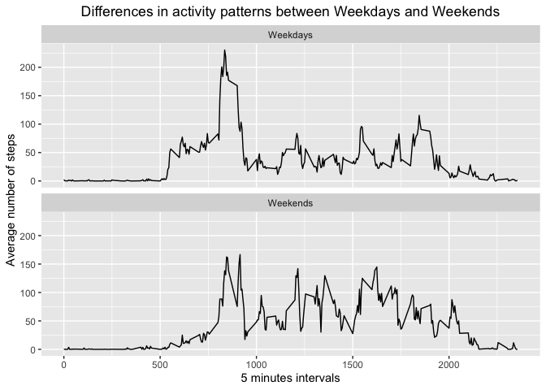

### Loading required libraries


```r
library(dplyr)
library(ggplot2)

# Avoid scientific notation for the numbers representation and round to 2 digits
options(scipen = 1, digits = 2)
```

### Loading and preprocessing the data


```r
df <- read.table("data/activity.csv", sep = ",", header = T)
df$date <- as.Date(as.character(df$date))
```

### Calculate the number of steps by day


```r
stepsByDay <- df %>%
   group_by(date) %>%
   summarise(steps = sum(steps, na.rm = T))
```

### Histogram of the total number of steps taken by day


```r
ggplot(stepsByDay, aes(steps)) + 
   geom_histogram(binwidth = 610, color = "darkblue", fill = "lightblue") +
   xlab("Total number of steps taken by day")
```

<!-- -->

### What is mean total and median number of steps taken per day?  


```r
nMean <- mean(stepsByDay$steps)
nMedian <- median(stepsByDay$steps)
```
The mean is 9354.23, and the median is 10395 

### What is the average daily activity pattern?  

1 - Make a time series plot of the 5-minute interval:  
_Prepare data_  


```r
MinuteInterval <- df %>% 
   group_by(interval) %>%
   summarise(steps = mean(steps, na.rm =T))
```

_Plot:_  


```r
ggplot(data=MinuteInterval, aes(x=interval, y=steps)) +
   geom_line() +
   xlab("5 minutes intervals") +
   ylab("Average number of steps") + 
   ggtitle("Average daily activity pattern") +
   theme(plot.title = element_text(hjust = 0.5))
```

<!-- -->

2 - Which 5-minute interval, on average across all the days in the dataset, contains the maximum number of steps?


```r
which5 <- MinuteInterval[which.max(MinuteInterval$steps),]
steps = which5$steps
which_rec = which5$interval
```

The interval that contents the maximum number of steps is 835 and the number of steps are 206.17 

### Imputing missing values

1 - Calculate and report the total number of missing values in the dataset  


```r
MissingValues <- sum(is.na(df$steps))
```
The number of missing values is 2304  

2 - Devise a strategy for filling in all of the missing values in the dataset.  


```r
# Create a new dataset that is equal to the original dataset but with the missing data filled in

NotActive <- df %>% 
   group_by(interval) %>%
   summarise(steps = mean(steps, na.rm =T))

MissingFilled <- df %>%
   mutate( steps = case_when( is.na(steps) ~ NotActive$steps[match(df$interval, 
   NotActive$interval)], 
   T ~ as.numeric(steps)))

MissingFilledGrouped <- MissingFilled %>% 
   group_by(date) %>% 
   summarise(steps = sum(steps))

# Make a histogram of the total number of steps taken each day ...
ggplot(MissingFilledGrouped, aes(steps)) + 
   geom_histogram(binwidth = 610, color = "darkblue", fill = "lightblue") + 
   xlab("Steps by day") +
   ggtitle("Total Number of Steps Taken by Day") +
   theme(plot.title = element_text(hjust = 0.5))
```

<!-- -->

_Report the mean and median total number of steps taken per day_  


```r
nMeanImputed <- mean(MissingFilledGrouped$steps)
nMedianImputed <- median(MissingFilledGrouped$steps)
```

When the missing values are imputed, the **mean** for the number of daily steps is 10766.19  and the **median** for the number of daily steps is 10766.19  


```r
nMeanDif <- nMeanImputed - nMean
nMedianDif <- nMedianImputed - nMedian
```

So the difference between the values before and after beeing imputed is 1411.96 for the **mean** of daily steps and 371.19 for the **median** of daily steps.  

### Are there differences in activity patterns between weekdays and weekends?  


```r
WeekOfDay <- MissingFilled %>%
   mutate(classday = case_when( 
   weekdays(MissingFilled$date) %in% c( "Saturday","Sunday") == T ~ "Weekends", 
   weekdays(MissingFilled$date) %in% c( "Saturday","Sunday") == F ~ "Weekdays")) %>%
   select(-date) %>%
   group_by(interval, classday ) %>%
   summarise(steps = mean(steps))

ggplot(WeekOfDay, aes(interval, steps)) + 
   geom_line() + 
   facet_wrap(~ classday, nrow = 2) +
   xlab( "5 minutes intervals" ) + 
   ylab( "Average number of steps" ) + 
   ggtitle("Differences in activity patterns between Weekdays and Weekends") +
   theme(plot.title = element_text(hjust = 0.5))
```

<!-- -->

From the gaphic, I can notice that during weekdays, there is a walking increment between the 500 / 1000 intervals, instead during weekends, there is a more constant walking activity between the 550 / 2000 intervals.  
